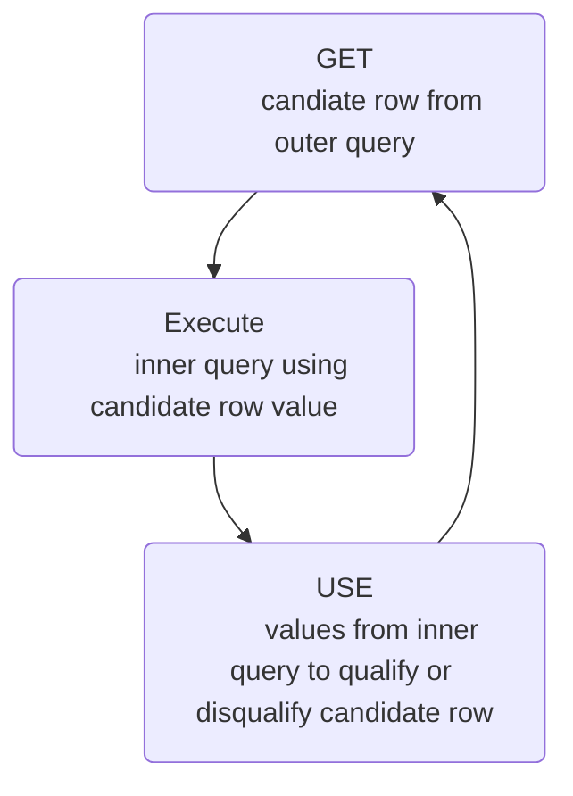

# Multiple Column Subqueries
Each row of the main query is compared to values from a multiple-row and multiple-column subquery

## Column Comparisons
Multiple column comparisons involving subqueries can be:
* Pairwise comparisons
* Nonpairwise comparisons
Nonpairwise comparison can potentially bring different data

# Scalar Subquery Expressions
* A scalar subquery is a subquery that returns exactly one column value from one row
* Scalar subqueries can be used in:
    * The conditional and expression part of **DECODE** and **CASE**
    * All clauses of **SELECT** except **GROUP BY**
    * The **SET** clause and **WHERE** clause of an **UPDATE** statement

# Correlated Subqueries
Correlated subqueries are used for row-by-row processing. Each subquery is executed once for every row of the outer query



```sql
SELECT column1, colum2, ...
FROM table1 Outer_table --> Parent table
WHERE column1 operator
    ( SELECT column1, column2
      FROM table2
      WHERE expr1 =
        Outer_table.expr2 --> Subquery
    );
```

# Using the EXISTS Operator
* The **EXISTS** operator tests for existence of rows in the results set of the subquery
* If a subquery row value is found:
    * The search does not continue in the inner query
    * The condition is flagged **TRUE**
* If a subquery row value is not found:
    * The condition is flagged **FALSE**
    * The search continues in the inner query

# WITH Clause
* Using the **WITH** clause, you can use the same query block in a **SELECT** statement when it occurs more than once within a complex query
* The **WITH** clause retrieves the results of a query block and stores them in the user's temporary tablespace
* The **WITH** clause can improve performance

## Recursive WITH Clause
The Recursive **WITH** clause:
* Enables formulation of recursive queries
* Creates a query with a name, called the Recursive **WITH** element name
* Contains two types of query block members: an anchor and a recursive
* Is ANSI compatible
